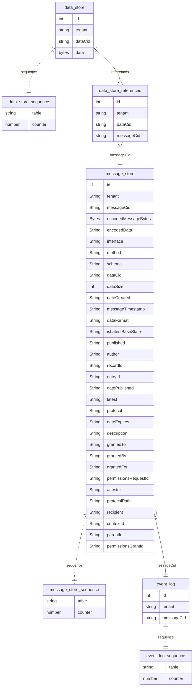

# dwn-cozo-store

## Why cozo 
- [COZO repo](https://github.com/cozodb/cozo) 

- [COZO tutorial](https://docs.cozodb.org/en/latest/tutorial.html)
> CozoDB is a general-purpose, transactional, relational database that uses Datalog for query, is embeddable but can also handle huge amounts of data and concurrency, and focuses on graph data and algorithms. It supports time travel and it is performant!
Cozo is open source DB and query engine that could be run on top of few storage engines. 

- In-memory, non-persistent backend
- SQLite storage backend
- RocksDB storage backend
- Sled storage backend
- TiKV distributed storage backend

It is targeted to be hight perfomance and scalable.

Also you could run wasm module on browser.

## Why cozo-store
I see a few benefits to use Cozo store for your DWNs

- nice for tests 
- TYPE SAFE and more strict 
- fast 
- could be embedded in your app

## How to use
As far as few cozo implementations differ a bit. I create a small interface that make library abstract from cozo build 
You need to implement this interface for your cozo build and pass it to the store. 

In memory example:
```ts
import { CozoDb } from 'cozo-node';
import { ICozoDb, CozoResult } from '../src/types.js';

export class InMemoryCozo implements ICozoDb {
  private db: CozoDb;

  constructor(db?: CozoDb) {
    this.db = db || new CozoDb('mem');
  }

  close(): void {
    return this.db.close();
  }

  // eslint-disable-next-line @typescript-eslint/no-explicit-any
  run(query: string, params?: Record<string, any>): Promise<CozoResult> {
    return this.db.run(query, params) as Promise<CozoResult>;
  }
}

  const cozo = new InMemoryCozo();
  const dataStore = new DataStoreCozo(cozo);
  const eventLog = new EventLogCozo(cozo);
  const messageStore = new MessageStoreCozo(cozo);


```

Sqlite example:
Project heavily inspired by [DWN SQL store](https://github.com/TBD54566975/dwn-sql-store) and use a lot of code borrowed from there.

## Store Entity Relation Diagram


