## Store Entity Relation Diagram

```mermaid
erDiagram
    data_store_sequence {
        string table 
        number counter
    }
      event_log_sequence {
        string table 
        number counter
    }
      message_store_sequence {
        string table 
        number counter
    }
    event_log {
        int Id 
        string tenant
        string messageCid
        String interface
        String method
        String schema
        String dataCid
        Int   dataSize
        String dateCreated
        String messageTimestamp
        String dataFormat
        String isLatestBaseState
        String published
        String author
        String recordId
        String entryId 
        String datePublished
        String latest
        String protocol
        String dateExpires
        String description
        String grantedTo
        String grantedBy
        String grantedFor
        String permissionsRequestId
        String attester
        String protocolPath
        String recipient
        String contextId
        String parentId
        String permissionsGrantId
    }
    data_store {
        int id 
        string tenant
        string dataCid
        bytes data
    }
    data_store_references {
        int id 
        string tenant
        string dataCid
        string messageCid
    }
    message_store {
        id id
        String tenant
        String messageCid
        Bytes encodedMessageBytes
        String encodedData
        String interface
        String method
        String schema
        String dataCid
        Int   dataSize
        String dateCreated
        String messageTimestamp
        String dataFormat
        String isLatestBaseState
        String published
        String author
        String recordId
        String entryId 
        String datePublished
        String latest
        String protocol
        String dateExpires
        String description
        String grantedTo
        String grantedBy
        String grantedFor
        String permissionsRequestId
        String attester
        String protocolPath
        String recipient
        String contextId
        String parentId
        String permissionsGrantId
    }
    event_log ||..|| event_log_sequence : sequence
    data_store ||..|| data_store_sequence : sequence
    message_store ||..|| message_store_sequence : sequence
    data_store ||--|{ data_store_references : references
    data_store_references }|--|| message_store : messageCid
    message_store }|--|| event_log : messageCid
```

## Index columns for message and event store 
| index | type |
|-------|------|
|    interface            | String?|
|    method               | String?|
|    schema               | String?|
|    dataCid              | String?|
|    dataSize             | Int?|
|   dateCreated          | String?|
|    messageTimestamp     | String?|
|    dataFormat           | String?|
|    isLatestBaseState    | String?|
|    published            | String?|
|    author               | String?|
|    recordId             | String?|
|    entryId              | String?|
|    datePublished        | String?|
|    latest               | String?|
|    protocol             | String?|
|    dateExpires          | String?|
|    description          | String?|
|    grantedTo            | String?|
|    grantedBy            | String?|
|    grantedFor           | String?|
|    permissionsRequestId | String?|
|    attester             | String?|
|    protocolPath         | String?|
|    recipient            | String?|
|    contextId            | String?|
|    parentId             | String?|
|    permissionsGrantId   | String?|